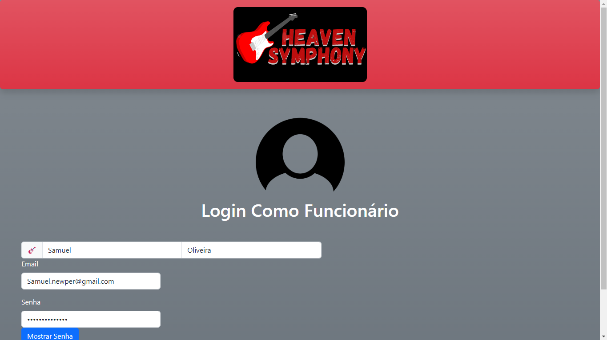
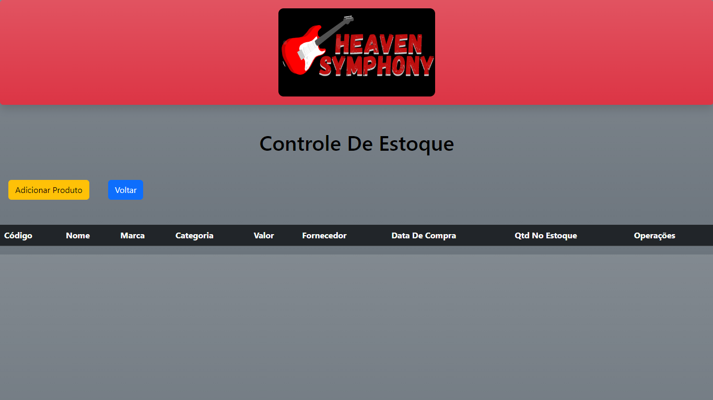
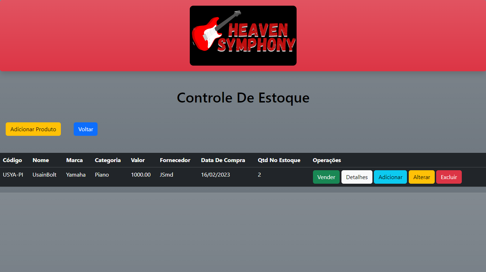

# HeavenSymphony - Sistema de Controle de Estoque

## Sobre o Projeto

HeavenSymphony é um sistema de gestão de estoque desenvolvido para uma loja fictícia de instrumentos musicais. O sistema permite que funcionários registrem-se, façam login, e gerenciem o inventário de produtos da loja. Cada produto pode ser adicionado, vendido, detalhado, editado ou excluído através de uma interface web intuitiva.

## Funcionalidades

- **Cadastro de Funcionários**: Novos funcionários podem se registrar fornecendo suas informações pessoais.
- **Login de Funcionários**: Funcionários podem fazer login para acessar o sistema de gestão de estoque.
- **Controle de Estoque**:
  - **Adicionar Produto**: Inserir novos produtos no estoque com informações detalhadas.
  - **Visualizar Produtos**: Uma tabela mostra todos os produtos com detalhes como Código, Nome, Marca, Categoria, Valor, Fornecedor, Data de Compra e Quantidade em Estoque.
  - **Operações de Produto**:
    - **Vender**: Registrar a venda de produtos.
    - **Detalhes**: Visualizar informações detalhadas de cada produto.
    - **Editar**: Alterar informações de produtos existentes.
    - **Excluir**: Remover produtos do sistema.
    - **Alterar Quantidade**: Atualizar a quantidade de produtos em estoque.

## Tecnologias Utilizadas

- **HTML5**: Estrutura da página web.
- **CSS3 e Bootstrap**: Design responsivo e estilização das páginas.
- **PHP**: Lógica do lado do servidor para manipulação de dados.
- **MySQL**: Banco de dados para armazenamento de todas as informações de produtos e usuários.

## Configuração e Instalação

Para configurar e executar o projeto localmente, siga estas etapas:

### Pré-requisitos

- Servidor web como XAMPP com PHP e MySQL.

### Instalação

1. **Clone o Repositório**
   ```bash
   git clone https://github.com/SamuelNzz1/SymphonyHeaven-Crud.git
   cd SymphonyHeaven-Crud

## Algumas Telas






